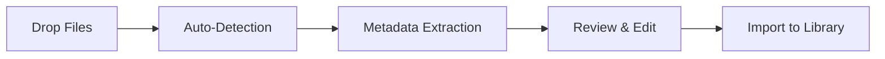

<div align="center">

# 📚 BookLore

### *Your Personal Library, Reimagined*

[](https://github.com/adityachandelgit/BookLore/releases)
[](LICENSE)
[](https://github.com/adityachandelgit/BookLore/stargazers)
[](https://hub.docker.com/r/booklore/booklore)

[](https://discord.gg/Ee5hd458Uz)
[](https://opencollective.com/booklore)

---

**A self-hosted, feature-rich platform for organizing and managing your digital book collection.**  
*Built for book lovers, by book lovers.*


[**✨ Live Demo**](https://demo.booklore.dev) • [**📖 Documentation**](https://booklore-app.github.io/booklore-docs/) • [**🐛 Report Bug**](https://github.com/adityachandelgit/BookLore/issues) • [**💡 Request Feature**](https://github.com/adityachandelgit/BookLore/issues)

</div>

---

## 🌟 Why BookLore?

BookLore transforms the way you interact with your digital library. Whether you're a casual reader or a bibliophile with thousands of titles, BookLore provides the tools you need to organize, discover, and enjoy your collection.

<table>
<tr>
<td width="50%">

### 📚 **Smart Library Management**
- Custom shelves with intelligent filtering
- Dynamic smart collections that auto-update
- Powerful search across your entire library
- Bulk operations for efficient management

</td>
<td width="50%">

### 🔄 **Seamless Integration**
- Native Kobo device synchronization
- KOReader progress tracking
- OPDS protocol support
- Email sharing capabilities

</td>
</tr>
<tr>
<td width="50%">

### 🧠 **Intelligent Metadata**
- Auto-fetch from multiple sources
- Goodreads, Amazon, Google Books integration
- Community reviews and ratings
- Custom metadata editing

</td>
<td width="50%">

### 👥 **Multi-User Ready**
- Granular permission controls
- OIDC authentication support
- Private notes per user
- Shared library management

</td>
</tr>
</table>

---

## ✨ Feature Highlights

<details open>
<summary><b>📖 Reading Experience</b></summary>

- **Built-in Reader**: Enjoy PDFs, EPUBs, and comics with customizable themes
- **Progress Tracking**: Sync reading progress across devices
- **Personal Notes**: Save private annotations visible only to you
- **Mobile Optimized**: Fully responsive design for reading anywhere

</details>

<details open>
<summary><b>🔧 Power Features</b></summary>

- **BookDrop Import**: Auto-detect and bulk import from a watched folder
- **Magic Shelves**: Create rule-based collections that update automatically
- **Format Conversion**: Automatic EPUB to KEPUB conversion
- **Metadata Enrichment**: Pull rich details from multiple online sources

</details>

<details open>
<summary><b>🌐 Connectivity</b></summary>

- **OPDS Server**: Connect any compatible reading app wirelessly
- **Kobo Integration**: Seamless sync with Kobo e-readers
- **API Access**: Programmatic access to your library
- **Email Distribution**: One-click book sharing via email

</details>

---

## 💖 Support Development

<div align="center">

Your support helps keep BookLore growing and improving!

[](https://opencollective.com/booklore)
[](https://github.com/adityachandelgit/BookLore)

</div>

**Current Fundraising Goal:** 🎯 Kobo Device for Testing  
Help us implement and test native Kobo sync support by [contributing to our bounty →](https://opencollective.com/booklore/projects/kobo-device-for-testing)

---

## 🌐 Try the Live Demo

Experience BookLore before deploying your own instance:

<div align="center">

| 🔗 | **[demo.booklore.dev](https://demo.booklore.dev)** |
|:---:|:---|
| 👤 | **Username:** `booklore` |
| 🔑 | **Password:** `9HC20PGGfitvWaZ1` |

</div>

> **📌 Note:** Demo has standard user permissions. Admin features require a self-hosted instance.

---

## 🚀 Quick Start

### Prerequisites

Ensure you have [Docker](https://docs.docker.com/get-docker/) and [Docker Compose](https://docs.docker.com/compose/install/) installed on your system.

### 📦 Available Images

| Registry | Image URL |
|----------|-----------|
| 🐳 Docker Hub | `booklore/booklore:latest` |
| 📦 GitHub | `ghcr.io/booklore-app/booklore:latest` |

> ⚠️ Legacy images at `ghcr.io/adityachandelgit/booklore-app` remain available but won't receive updates.

---

## 🐳 Docker Deployment

### Step 1: Create Environment Configuration

Create a `.env` file with your configuration:

```ini
# Application Settings
APP_USER_ID=0
APP_GROUP_ID=0
TZ=Etc/UTC
BOOKLORE_PORT=6060

# Database Connection
DATABASE_URL=jdbc:mariadb://mariadb:3306/booklore
DB_USER=booklore
DB_PASSWORD=ChangeMe_BookLoreApp_2025!

# MariaDB Configuration
DB_USER_ID=1000
DB_GROUP_ID=1000
MYSQL_ROOT_PASSWORD=ChangeMe_MariaDBRoot_2025!
MYSQL_DATABASE=booklore
```

### Step 2: Create Docker Compose File

Create `docker-compose.yml`:

```yaml
services:
  booklore:
    image: booklore/booklore:latest
    container_name: booklore
    environment:
      - USER_ID=${APP_USER_ID}
      - GROUP_ID=${APP_GROUP_ID}
      - TZ=${TZ}
      - DATABASE_URL=${DATABASE_URL}
      - DATABASE_USERNAME=${DB_USER}
      - DATABASE_PASSWORD=${DB_PASSWORD}
      - BOOKLORE_PORT=${BOOKLORE_PORT}
    depends_on:
      mariadb:
        condition: service_healthy
    ports:
      - "${BOOKLORE_PORT}:${BOOKLORE_PORT}"
    volumes:
      - ./data:/app/data
      - ./books:/books
      - ./bookdrop:/bookdrop
    restart: unless-stopped

  mariadb:
    image: lscr.io/linuxserver/mariadb:11.4.5
    container_name: mariadb
    environment:
      - PUID=${DB_USER_ID}
      - PGID=${DB_GROUP_ID}
      - TZ=${TZ}
      - MYSQL_ROOT_PASSWORD=${MYSQL_ROOT_PASSWORD}
      - MYSQL_DATABASE=${MYSQL_DATABASE}
      - MYSQL_USER=${DB_USER}
      - MYSQL_PASSWORD=${DB_PASSWORD}
    volumes:
      - ./mariadb/config:/config
    restart: unless-stopped
    healthcheck:
      test: ["CMD", "mariadb-admin", "ping", "-h", "localhost"]
      interval: 5s
      timeout: 5s
      retries: 10
```

### Step 3: Launch BookLore

```bash
docker compose up -d
```

### Step 4: Access Your Library

Open your browser and navigate to:

```
http://localhost:6060
```

---

## 📥 BookDrop: Automated Import

The **BookDrop** feature enables effortless bulk importing of books into your library.

### How It Works



1. **📁 Drop Files**: Place books in the BookDrop folder
2. **🔍 Detection**: Automatic file monitoring and recognition
3. **📊 Metadata**: Extract or fetch book information
4. **✏️ Review**: Edit metadata before final import
5. **✅ Import**: Add to your organized library

### Configuration

The BookDrop folder is automatically configured in the Docker setup:

```yaml
volumes:
  - ./bookdrop:/bookdrop  # 👈 Auto-import directory
```

Simply drop your `.pdf`, `.epub`, `.cbz`, or other supported files into this folder, and BookLore handles the rest!

---

## 📚 Documentation

For comprehensive guides, configuration options, and troubleshooting:

<div align="center">

### **[📖 Visit Full Documentation →](https://booklore-app.github.io/booklore-docs/docs/getting-started/)**

*Installation • Configuration • Features • API • Troubleshooting*

</div>

💡 **Contribute to Docs**: Improve our documentation at [booklore-app/booklore-docs](https://github.com/booklore-app/booklore-docs)

---

## 🤝 Community & Contribution

<div align="center">

[](https://discord.gg/Ee5hd458Uz)
[](CONTRIBUTING.md)
[](https://github.com/adityachandelgit/BookLore/issues)

</div>

We welcome contributions of all kinds! Whether it's:
- 🐛 Bug reports and fixes
- ✨ Feature requests and implementations
- 📖 Documentation improvements
- 🌍 Translations and localization

---

## 📊 Project Stats

<div align="center">

### Repository Activity


### ⭐ Star History

<a href="https://www.star-history.com/#booklore-app/booklore&type=date&legend=top-left">
 <picture>
   <source media="(prefers-color-scheme: dark)" srcset="https://api.star-history.com/svg?repos=booklore-app/booklore&type=date&theme=dark&legend=top-left" />
   <source media="(prefers-color-scheme: light)" srcset="https://api.star-history.com/svg?repos=booklore-app/booklore&type=date&legend=top-left" />
   
 </picture>
</a>

</div>

---

## 🙏 Contributors

Thank you to all our amazing contributors who help make BookLore better!

<div align="center">

[](https://github.com/adityachandelgit/BookLore/graphs/contributors)

</div>

---

## ⚖️ License

<div align="center">

**[GNU General Public License v3.0](http://www.gnu.org/licenses/gpl.html)**

Copyright © 2024-2025 BookLore Contributors

</div>

---

<div align="center">

**Made with ❤️ by the BookLore Community**

*Star ⭐ this repository if you find it helpful!*

</div>
